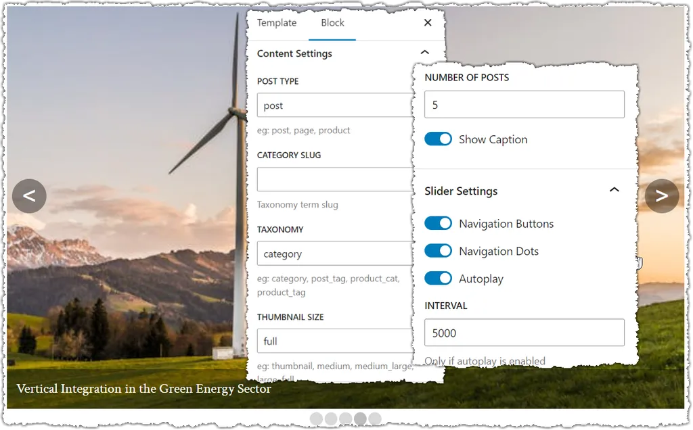
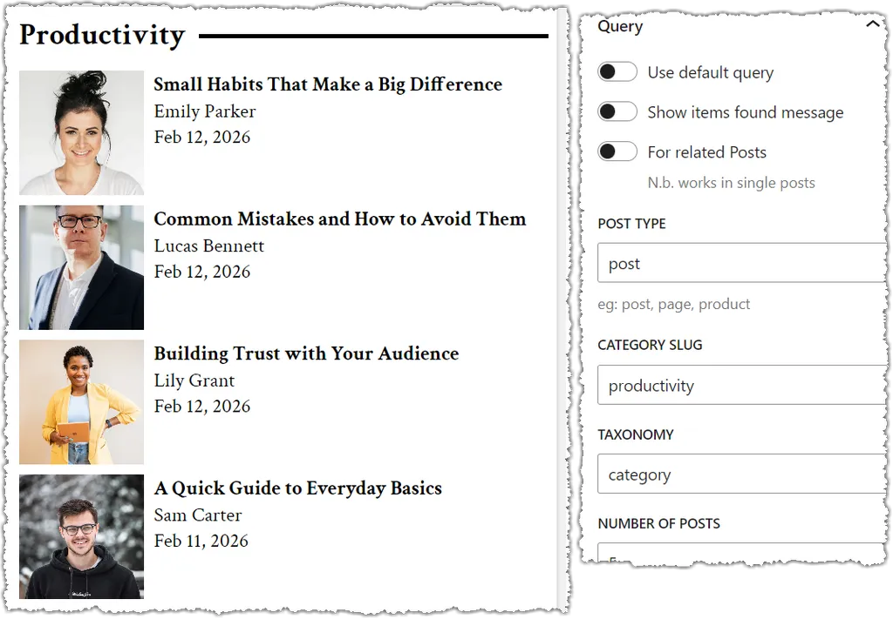
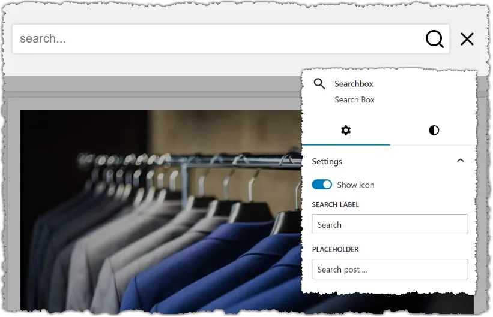
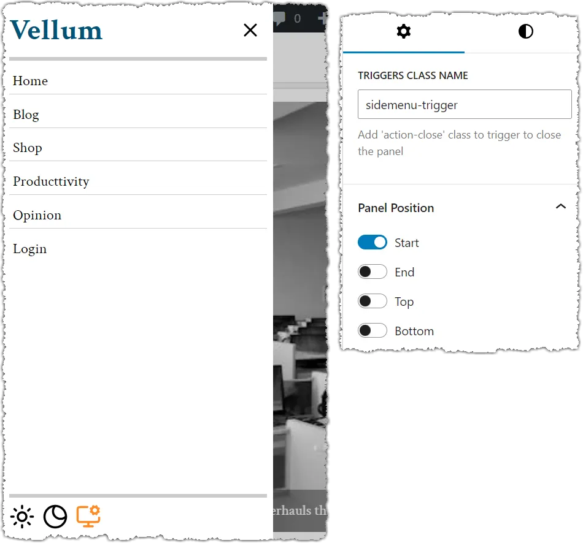
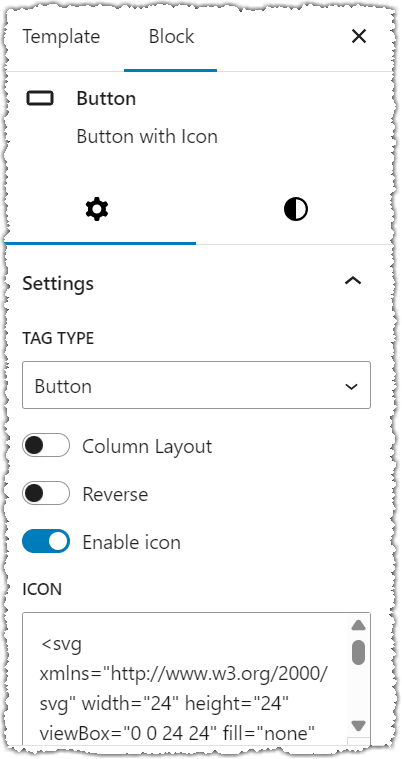
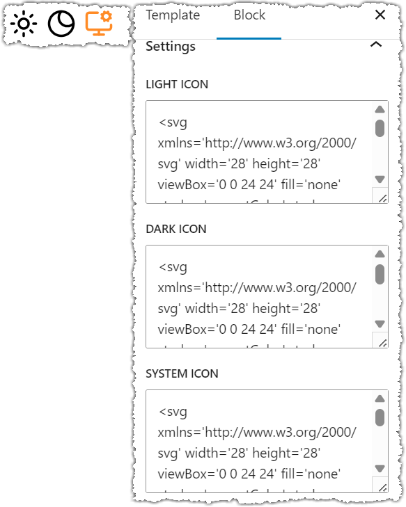

# Ait Blocks: Wordpress Plugin for Custom Blocks
### Free wordpress plugin to enable some essential custom blocks on your website
Wordpess is powerful content management system, and the blocks concept made it easy to insert components in the text editor like paragraphs, headings, images, links...

However, wordpress itself does not provide some blocks you likely need for your website such as **Slider/Carousel** to display content in slides, **Side panels** on left, right, top and bottom position to display content like mobile navigation menu.
## Installation
There are two ways to install this plugin on your wordperss site:
### Method 1:
Download the already compressed file **ait-blocks.zip** from [dropbox](https://www.dropbox.com/scl/fi/t1s22m2fumtalspq7mfym/ait-blocks.zip?rlkey=ubfiaxlugw3ef462vrw62wc3g&e=1&st=wx78dyn3&dl=1).
### Method 2:
1. Clone this repository to your machine and run <code>**npm run build**</code>
2. Move these files: **build** [folder], **langauges** [folder], **ait-blocks.php** [file] to a directory named: **ait-blocks**.
3. compress that directory to a zip file named **ait-blocks.zip** (the directory itself must be inside the zip archive)
### Install the zip file
Go to your wordpress site > **plugins** > **add plugin** > **upload plugin** > choose ait-blocks.zip file

## Available Blocks
* Slider
* Query Posts
* Search Box
* Sidepanel
* Button
* Theme Controllers
## Screenshots
### 1. Slider
The Slider/Carousel displays posts with thumbnails based on post type, category, tag or custom taxonomy.

### 2. Query Posts
Custom query to display recent posts

### 3. Search Box Block
Custom search box with search icon

### 4. Side-panel
Display hidden sidepanels in position like left, right, top, bottom. To show/hide panel just define **Triggers Class Name** and it that class to **buttons** and elements you want to control the sidepanel.

You can make the trigger to close hide the panel by adding class: **action-close**

### 5. Button Block
Custom button block with/without svg icon. To convert the button to link element just choose "link" from **Tag Type** and enter the url.

### 6. Theme Controllers
Custom dark/light mode icons based

